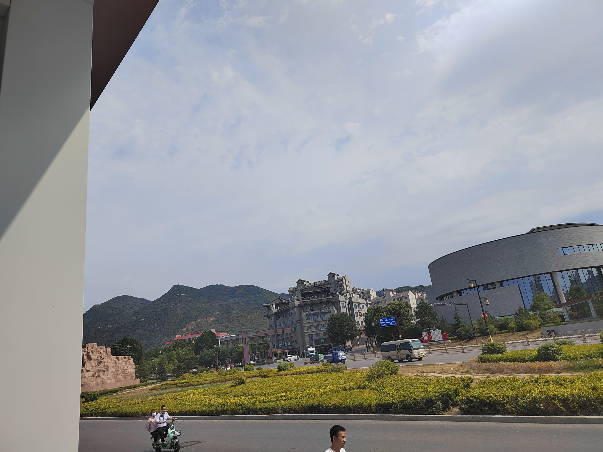
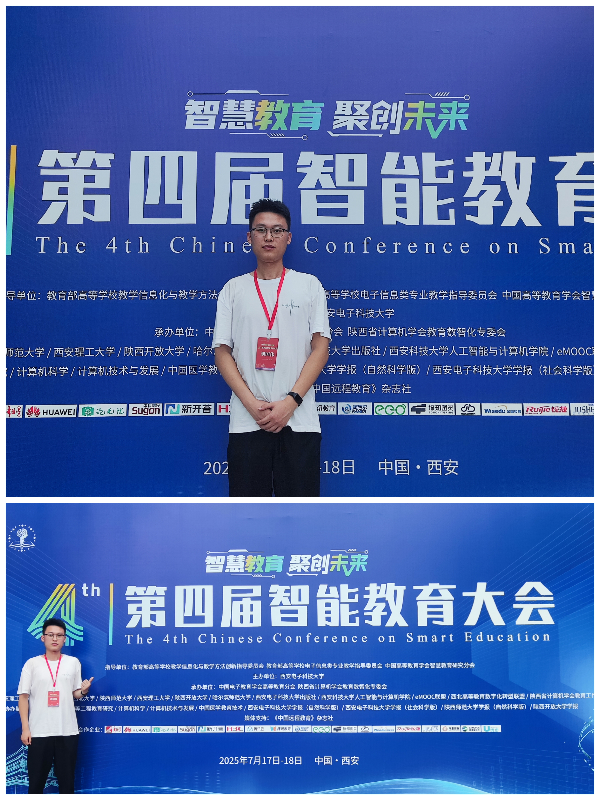
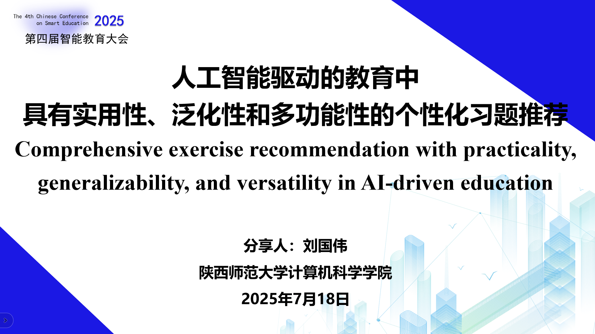
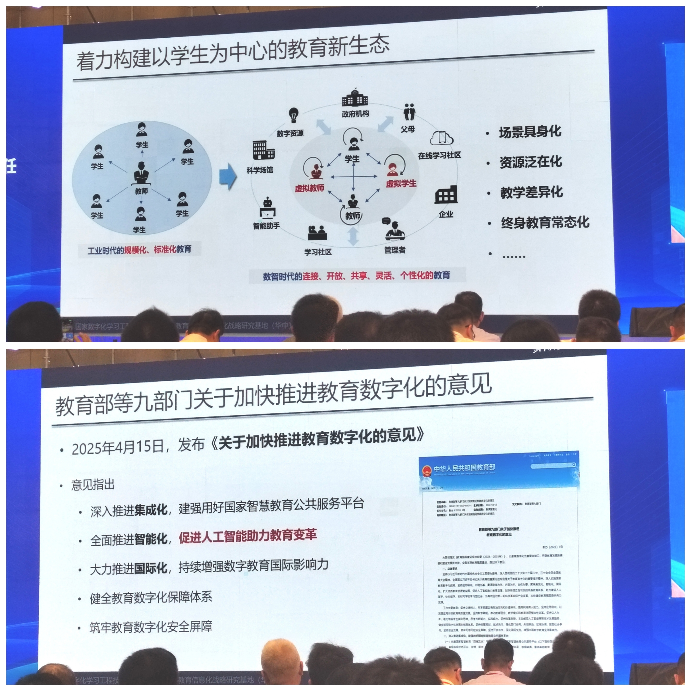
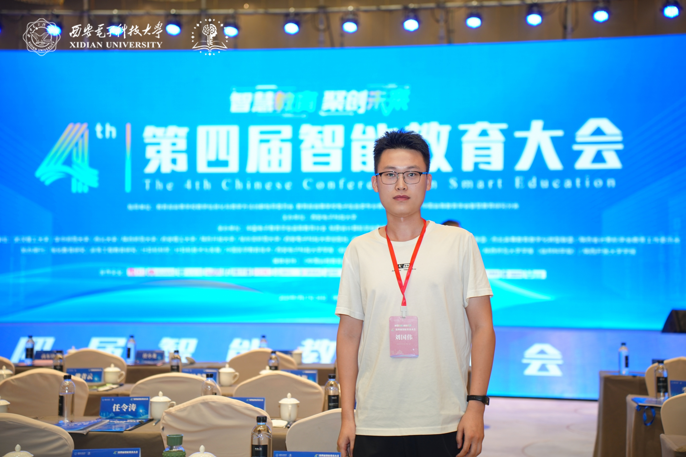
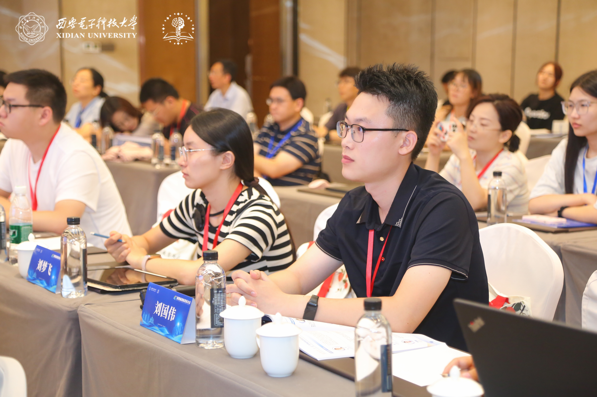
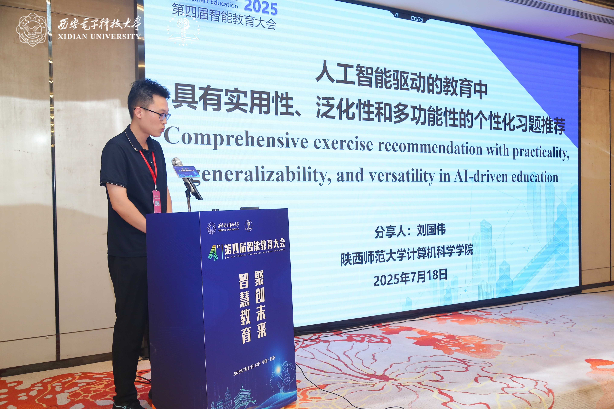
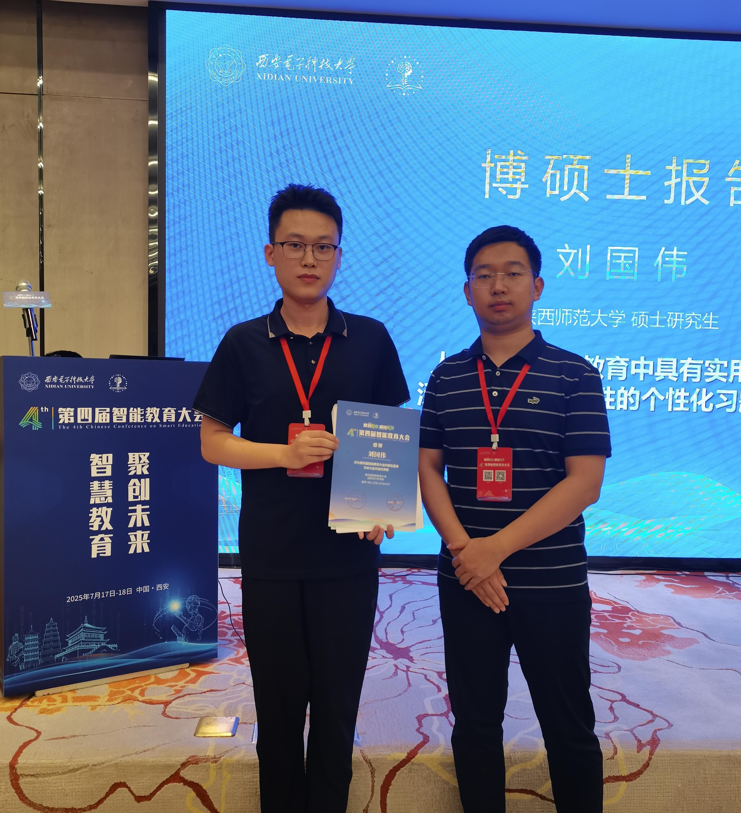
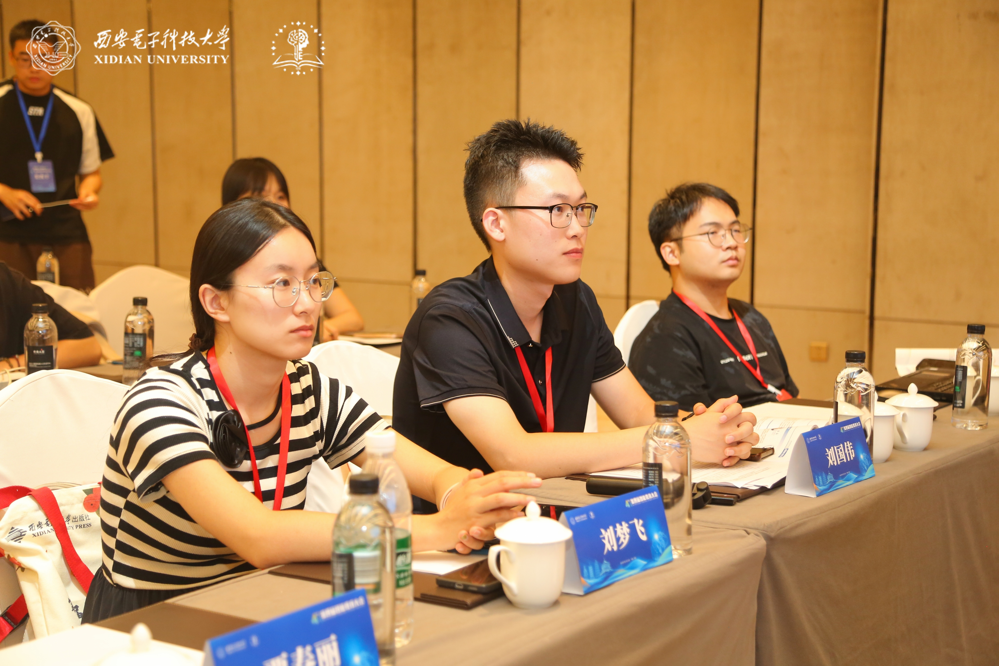

## 第四届智能教育大会

- 时间：2025年7月17~18日
- 地点：西安市临潼区长安先导国际创新人才交流中心
- 参会目的：在分论坛7“智能教育技术博士论坛”以教育硕士身份做论文报告《Comprehensive exercise recommendation with practicality, generalizability, and versatility in AI-driven education》

### Day 1

和女朋友一起，从家做5h27m的高铁到西安北，然后做1h+的地铁到临潼，步行600米到酒店，到了之后东西南北都分不出来了。一出地铁站就看到了骊山。

然后步行去签到，这个酒店最好的地方就是有摆渡车，非常赞！

领上物料后打卡记录（有3张自助餐券，又很赞！）

回来之后又得修改修改论文~~

### Day 2

上午听专家大咖的报告。

中午吃个快快的自助餐，下午再去作报告。

自助餐拍的太丑了，下次一定拍好看，就不放了~~
